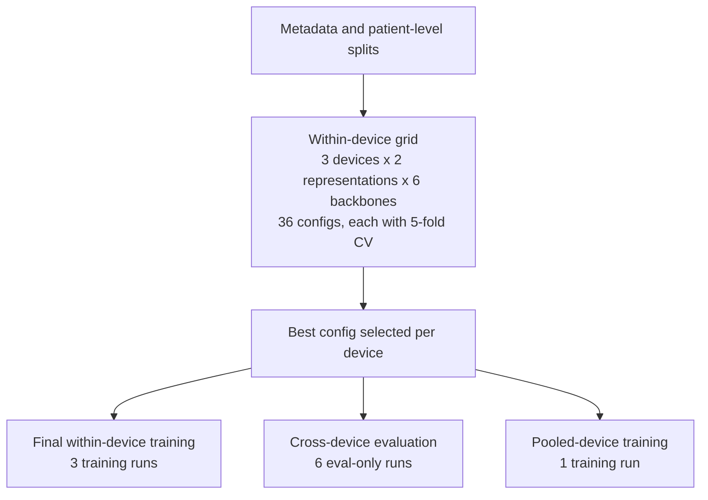

# Deep Learning Analysis of Smartphone and Digital Stethoscope Phonocardiograms for Detection of Reduced Left Ventricular Ejection Fraction

This repository contains the code for my final year project for the Bachelor of Biomedical Sciences programme, Li Ka Shing Faculty of Medicine, The University of Hong Kong.

The project studies reduced left ventricular ejection fraction (LVEF) detection from phonocardiograms (PCGs) using deep learning. The main comparisons are:
- within-device training and evaluation
- cross-device transfer
- pooled-device training
- MFCC versus gammatone representations
- lightweight CNN backbones versus Swin Transformer backbones

The task is binary classification: reduced LVEF (`EF <= 40%`) versus non-reduced LVEF (`EF > 40%`).

## Table of Contents
- [Scope](#scope)
- [Data Source and Study Context](#data-source-and-study-context)
- [Repository Layout](#repository-layout)
- [Private Data](#private-data)
- [Preprocessing](#preprocessing)
- [Experiment Workflow](#experiment-workflow)
- [Setup](#setup)
- [Typical Workflow](#typical-workflow)
- [Google Colab](#google-colab)
- [Preliminary Experiments](#preliminary-experiments)
- [Citation](#citation)
- [License](#license)

## Scope
- Research code only
- No raw audio or linked clinical labels are distributed here
- Not intended for clinical deployment

## Data Source and Study Context
The heart sound and LVEF data used in this project come from a de-identified stratified random sample derived from [ClinicalTrials.gov NCT06070298](https://clinicaltrials.gov/study/NCT06070298). The registered study concerns smartphone-based phonocardiography for murmur detection, whereas this repository focuses on reduced-LVEF screening using the same heart-sound acquisition protocol.

High-level study context shared with the registered study:
- observational study approved by the Institutional Review Board of the University of Hong Kong / Hospital Authority Hong Kong West Cluster
- adult cardiology outpatients aged 22 years or above who had undergone echocardiography within 3 years
- exclusion of participants with implanted active medical devices in the torso
- recordings collected by research personnel during routine clinic or day-centre visits after consent
- intended acquisition at the 4 standard cardiac auscultation sites using 3 devices: iPhone, Android phone, and a digital stethoscope
- up to 12 recordings per participant (`4 sites x 3 devices`), although some participants have fewer or more recordings
- real-world public hospital recording conditions rather than a controlled acoustic environment

The subset used for this project contains WAV heart-sound recordings plus an LVEF CSV. It does not include additional clinical covariates such as age, sex, or BMI.

## Repository Layout
- `src/data/`: metadata building, split generation, quality checks, and feature-statistics utilities
- `src/datasets/`: dataset loading and on-the-fly time-frequency feature generation
- `src/models/`: model factory and backbone definitions
- `src/training/`: training and evaluation entrypoint
- `src/experiments/`: cross-validation runner and best-configuration selection
- `colab_pipeline.ipynb`: guided end-to-end workflow for Google Colab

## Private Data
This repository expects local access to private study data, but those files are intentionally excluded from version control. The heart-sound recordings and LVEF labels are not shared here because they originate from human-participant data and remain restricted for participant privacy, ethics approval, and local data-governance reasons.

Expected local inputs:
- `heart_sounds/` with per-patient WAV files
- `lvef.csv` with `patient_id` and `ef`

The following are gitignored by default:
- raw audio and label files
- generated metadata and split files
- checkpoints, results, and reports
- other derived artifacts

## Preprocessing
The training pipeline performs feature generation on the fly.

At a high level, each recording is:
- loaded from WAV
- resampled to the target sampling rate (default: 2 kHz)
- band-pass filtered (`20-800 Hz`)
- center-cropped or zero-padded to a fixed duration (default: 4 s)
- converted to either MFCC or gammatone representation
- resized to the requested image size for ImageNet-pretrained backbones

Patient-level splits are used throughout to avoid leakage across multiple recordings from the same participant.

## Experiment Workflow
The main experiment grid covers:
- `3 devices x 2 representations x 6 backbones = 36` within-device configurations
- each configuration evaluated with 5-fold cross-validation

After configuration selection:
- one final checkpoint is trained per device using the selected configuration (`3` training runs)
- each best-config device model is evaluated on the other two devices (`6` eval-only runs)
- one pooled-device model is trained using the selected configuration

This structure supports within-device, cross-device, and pooled-device comparisons under a consistent pipeline.



## Setup
Python 3.10+ is recommended.

Flexible dependency install:
```bash
pip install -r requirements.txt
```

Pinned dependency install for stricter reproduction:
```bash
pip install -r requirements-lock.txt
```

If you need GPU support, install a compatible PyTorch build first, then install the remaining packages.

## Typical Workflow
Build metadata:
```bash
python -m src.data.build_metadata \
  --lvef_csv lvef.csv \
  --heart_dir heart_sounds \
  --output_csv metadata.csv
```

Create final train/validation/test splits:
```bash
python -m src.data.make_patient_splits \
  --metadata_csv metadata.csv \
  --output_dir splits
```

Create patient-level CV folds:
```bash
python -m src.data.make_patient_cv_splits \
  --metadata_csv metadata.csv \
  --output_dir splits/cv \
  --n_splits 5 \
  --n_repeats 1
```

Run cross-validation for a candidate configuration:
```bash
python -m src.experiments.run_cv \
  --cv_index splits/cv/index.csv \
  --results_dir results \
  --output_dir checkpoints \
  -- \
  --representation mfcc \
  --backbone mobilenetv2 \
  --auto_pos_weight \
  --tune_threshold
```

Select the best configuration per device from a CV-only summary file:
```bash
python -m src.experiments.select_best_config \
  --summary_csv results/summary.csv \
  --expected_folds 5 \
  --output_csv results/selection/best_config_per_device.csv \
  --all_csv results/selection/config_summary_by_device.csv
```

Train a final model:
```bash
python -m src.training.train \
  --train_csv splits/metadata_train.csv \
  --val_csv splits/metadata_val.csv \
  --test_csv splits/metadata_test.csv \
  --representation mfcc \
  --backbone mobilenetv2 \
  --auto_pos_weight \
  --tune_threshold \
  --amp \
  --save_predictions \
  --results_dir results
```

Evaluate a saved checkpoint without retraining:
```bash
python -m src.training.train \
  --eval_only \
  --checkpoint_path checkpoints/<run_name>/best.pth \
  --train_csv splits/metadata_train.csv \
  --val_csv splits/metadata_val.csv \
  --test_csv splits/metadata_test.csv \
  --per_device_eval \
  --save_predictions \
  --results_dir results
```

## Google Colab
Use `colab_pipeline.ipynb` for a guided end-to-end run on Google Colab.

## Preliminary Experiments
These earlier repositories were completed to help me define the scope of this final project:
- [Multi-Task vs Single-Task Modeling for PCG Analysis](https://github.com/anywheredoor/pcg_experiment_1)
- [PCG-Only Baseline for Reduced LVEF Detection (ViT-B/16)](https://github.com/anywheredoor/pcg_experiment_2)
- [Phonocardiogram MIL Pipeline for Reduced LVEF Screening](https://github.com/anywheredoor/pcg_experiment_3)

## Citation
Citation metadata is provided in `CITATION.cff`.

## License
Apache License 2.0. See `LICENSE`.
